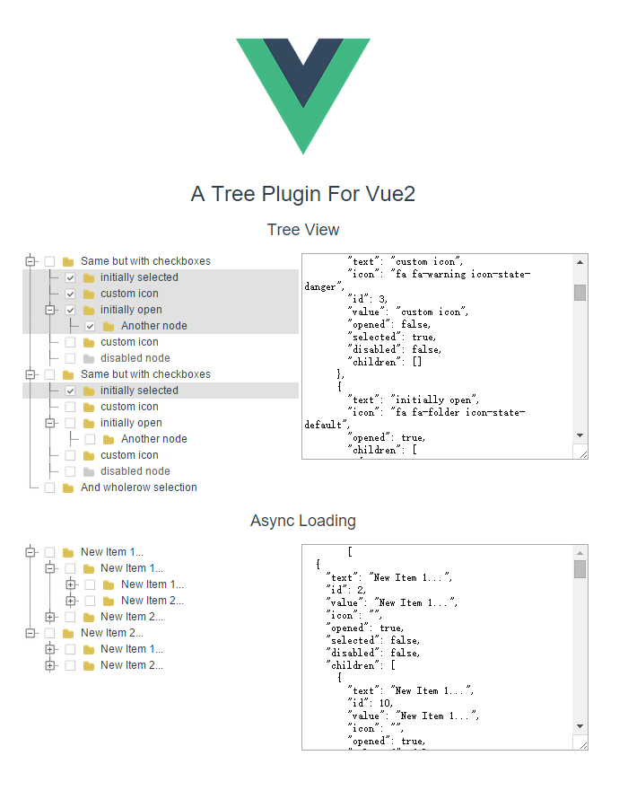

# vue-jstree

[](https://github.com/zdy1988/vue-jstree)

[English](./README.md)/[中文](./README-CN.md)

##  Introduction

A tree plugin for vue2



##  DEMO

[http://zdy1988.github.io/vue-jstree](http://zdy1988.github.io/vue-jstree)

##  NPM

```html
    npm install vue-jstree
```

##  ES6

```html
    import VJstree from 'vue-jstree'
    
    new Vue({
      components: {
        VJstree
      }
    })
```

##  Setup

```html
    npm install
    npm run dev
```

## Usage

```html
    <v-jstree :data="data" show-checkbox multiple allow-batch whole-row @item-click="itemClick"></v-jstree>
    
    new Vue({
      data: {
        data: [
          {
            "text": "Same but with checkboxes",
            "children": [
              {
                "text": "initially selected",
                "selected": true
              },
              {
                "text": "custom icon",
                "icon": "fa fa-warning icon-state-danger"
              },
              {
                "text": "initially open",
                "icon": "fa fa-folder icon-state-default",
                "opened": true,
                "children": [
                  {
                    "text": "Another node"
                  }
                ]
              },
              {
                "text": "custom icon",
                "icon": "fa fa-warning icon-state-warning"
              },
              {
                "text": "disabled node",
                "icon": "fa fa-check icon-state-success",
                "disabled": true
              }
            ]
          },
          {
            "text": "Same but with checkboxes",
            "opened": true,
            "children": [
              {
                "text": "initially selected",
                "selected": true
              },
              {
                "text": "custom icon",
                "icon": "fa fa-warning icon-state-danger"
              },
              {
                "text": "initially open",
                "icon": "fa fa-folder icon-state-default",
                "opened": true,
                "children": [
                  {
                    "text": "Another node"
                  }
                ]
              },
              {
                "text": "custom icon",
                "icon": "fa fa-warning icon-state-warning"
              },
              {
                "text": "disabled node",
                "icon": "fa fa-check icon-state-success",
                "disabled": true
              }
            ]
          },
          {
            "text": "And wholerow selection"
          }
        ]
      },
      methods: {
        itemClick (node) {
          console.log(node.model.text + ' clicked !')
        }
      }
    })
```

## API

| Props        | Type           | Default  |  Describe  |
| ------------- |:-------------:|:-----:|:--------------------------------------------------------|
| data      | Array |  |  set tree data  |
| size      | String      |   |  set tree item size , value : 'large' or '' or ''small' |
| show-checkbox | Boolean      |    false |   |
| allow-transition | Boolean      |    true |   |
| whole-row | Boolean      |    false |   |
| no-dots | Boolean      |    false |  |
| collapse | Boolean      |    false |  set all tree item collapse state |
| multiple | Boolean      |    false |  set multiple selected tree item  |
| allow-batch | Boolean      |    false |   |
| text-field-name | String      |    'text' |  set tree item display field |
| value-field-name | String      |    'value' |  set tree item value field |
| children-field-name | String      |    'children' |  set tree item children field |
| item-events | Object      |    {} |  register any event to tree item, [example](https://github.com/zdy1988/vue-jstree/blob/master/App.vue)  |
| async | Function      |     |  async load callback function , if node is a leaf ,you can set 'isLeaf: true' in data  |
| loading-text | String      |    'Loading' |  set loading text |
| draggable | Boolean      |    false |  set tree item can be dragged , selective drag and drop can set 'dragDisabled: true' and 'dropDisabled: true' , all default value is 'false' |
| drag-over-background-color | String | '#C9FDC9' |  set drag over background color |
| klass | String      |     |  set append tree class |

## Methods in node.model

| Method        | Params        |
| ------------- |:-------------:|
| addChild      | (object) newDataItem |
| addAfter      | (object) newDataItem, (object) selectedNode |
| addBefore     | (object) newDataItem, (object) selectedNode |
| openChildren  |  |
| closeChildren  |  |

## Event

**@item-click(node, item, e)**

**@item-toggle(node, item, e)**

**@item-drag-start(node, item, e)**

**@item-drag-end(node, item, e)**

**@item-drop-before(node, item, draggedItem, e)**

**@item-drop(node, item, draggedItem, e)**

**node** : current node vue object

**item** : current node data item object

**e** : event

## Data Item Optional Properties

| Name        | Type           | Default  | Describe  |
| ------------- |:-------------:| -----:|:----------------------------------------------|
| icon      | String      |   | custom icon css class |
| opened | Boolean      |    false | set leaf opened |
| selected | Boolean      |    false | set node selected |
| disabled | Boolean      |    false | set node disabled |
| isLeaf | Boolean      |    false | if node is a leaf , set true can hide '+' |
| dragDisabled | Boolean      |    false |  selective drag |
| dropDisabled | Boolean      |    false |  selective drop |

## Custom Item Example

```
     <v-jstree :data="data">
       <template scope="_">
         <div style="display: inherit; width: 200px" @click.ctrl="customItemClickWithCtrl">
           <i :class="_.vm.themeIconClasses" role="presentation" v-if="!_.model.loading"></i>
           {{_.model.text}}
           <button style="border: 0px; background-color: transparent; cursor: pointer;" @click="customItemClick(_.vm, _.model, $event)"><i class="fa fa-remove"></i></button>
         </div>
       </template>
     </v-jstree>

     **scope** be replaced in the **vue@2.5.0+** , over **vue@2.5.0+** use **slot-scope**
```

## License

Licensed under the [MIT license](https://opensource.org/licenses/mit-license.php).

Thanks For [jstree](https://github.com/vakata/jstree)'s UI